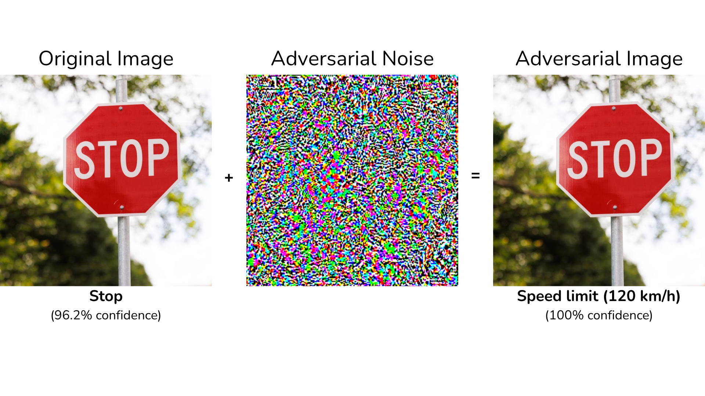

# 🛡️ Adversarial Attacks in Vision Deep Learning Models

[](https://www.python.org/)
[](https://www.tensorflow.org/)
[](https://streamlit.io/)
[](https://plotly.com/)
[](https://opensource.org/licenses/MIT)
[](https://adversarial-attacks-vision.streamlit.app/)

> **Unveiling the geometric and topological vulnerabilities of Convolutional Neural Networks through Adversarial Machine Learning.**

## 📖 Project Overview

Convolutional Neural Networks (CNNs) have achieved superhuman performance in image classification. However, they possess a critical and fascinating vulnerability: **Adversarial Examples**. By applying carefully crafted, imperceptible mathematical noise to an image using gradient descent, we can force a highly confident, yet completely incorrect prediction from the network.



**Origin & Evolution:**
This project originated as my **Bachelor's Thesis (TFG)** for the Double Major in Mathematics and Computer Science at University of Seville. Driven by the mathematical depth of the topic, I continuously expanded the codebase to include advanced topological research. Aspects of this ongoing research and related methodologies have been adapted for academic conferences.

Designed to bridge theoretical research and practical software engineering, this repository provides both the rigorous mathematical implementations of these attacks and a production-ready interactive dashboard to explore CNN vulnerabilities in real-time.

---

## ✨ Key Features & Research Areas

1. **State-of-the-Art Attack Implementations:** Clean, optimized TensorFlow algorithms for Fast Gradient Sign Method (FGSM), Projected Gradient Descent (PGD), Carlini & Wagner (C&W), DeepFool, and Targeted I-FGSM.
2. **Quantitative Robustness Analytics:** Mass evaluation of models (MobileNetV2, EfficientNetB0, InceptionV3) tracking Attack Success Rate (ASR) vs perceptual distortion (L2 norm), alongside transferability heatmaps.
3. **Latent Space Topology:** Dimensionality reduction (PCA and t-SNE) mapping how adversarial vectors physically push data points across decision boundaries inside the network's hidden layers.
4. **Attractors & 3D Loss Landscapes:** Visualization of the complex non-convex loss surfaces, illustrating how gradient-based attacks navigate "mountains of error" and fall into adversarial sink classes.
5. **Interactive Web Dashboard:** A complete, object-oriented Streamlit application that wraps the mathematical engine, allowing users to upload images and hack neural networks live from their browser.

---

## 🏆 Academic & Research Recognition

What started as my **Bachelor's Thesis (TFG)** has evolved into an active, ongoing research project. It explores the mathematical formalization of adversarial vulnerabilities, from geometric decision boundaries to spectral analysis in the Fourier domain.

* **Academic Achievement:** Bachelor's Thesis (TFG) – Grade: **10 / 10** *(Double Major in Mathematics & Computer Science, University of Seville)*.
* **Conferences & Talks:**
  * 🗣️ *Congreso Andaluz.IA* (Dec 2025)
  * 🗣️ *Jornada Destacando Talentos en la ETSII* (May 2025)
* **Current Status:** Ongoing active research and development.

---

## 📂 Repository Architecture

The project is strictly modularized, separating the mathematical research engine from the production-ready web application:

    ├── dashboard/                   # Interactive Streamlit Web Application (SaaS-style)
    │   ├── Home.py                  # Main entry point and global KPIs
    │   ├── pages/                   # UI modules: Playground, Robustness, Latent Space, 3D Loss
    │   ├── utils/                   # Backend logic (Attack algorithms, Model caching, Plotly charts)
    │   ├── data/                    # Precomputed CSV metrics for optimized UI loading
    │   └── assets/                  # Custom CSS
    │
    ├── attacks/                     # Core mathematical implementations of adversarial algorithms
    │   └── Notebooks: FGSM, PGD, C&W, DeepFool, Targeted I-FGSM
    │
    ├── robustness_evaluation/       # Mass-evaluation engine and quantitative analytics
    │   ├── robustness_metrics.csv   # Aggregated results (ASR, L2 distortion) across models
    │   └── Notebooks & HTMLs: Radar charts, Transferability heatmaps, Vulnerability profiles
    │
    ├── latent_space/                # Dimensionality reduction mapping internal CNN representations
    │   └── Notebooks: PCA & t-SNE tracking attack trajectories and decision boundary crossings
    │
    ├── loss_landscape_3d/           # Interactive 3D topology of non-convex loss surfaces
    │   └── Notebooks & HTMLs: Loss landscapes around specific images (Dog, Lion) across models
    │
    ├── adversarial_attractors/      # Advanced research on attack convergence and dynamics
    │   └── Notebooks: Epsilon evolution and mathematical attractors (sink classes)
    │
    ├── images/                      # Sample datasets including a MiniImageNet 100-image subset
    │
    └── Adversarial Attacks in Vision Deep Learning Models.pdf  # Original Research Thesis
---

## 🚀 Getting Started

**🌐 Live Demo:** Don't want to install anything? You can test the interactive dashboard and run real-time adversarial attacks directly in your browser:
👉 **[Launch the Web Application](https://adversarial-attacks-vision.streamlit.app/)**

If you prefer to run the project locally and explore the code:

**1. Clone the repository:**
```
git clone https://github.com/fragompul/adversarial_attacks_vision.git
cd adversarial_attacks_vision
```

**2. Install dependencies:**
It is recommended to use a virtual environment (venv or conda).
```
cd dashboard
pip install -r dashboard/requirements.txt
```

**3. Launch the Streamlit Dashboard:**
```
streamlit run Home.py
```

The application will automatically open in your default web browser at http://localhost:8501.

---

## 🛠️ Technology Stack

* **Deep Learning Framework:** TensorFlow 2.x / Keras
* **Computer Vision & Image Processing:** NumPy, Pillow (PIL), OpenCV
* **Data Science & ML:** Scikit-Learn (PCA/t-SNE), Pandas
* **Data Visualization:** Plotly Graph Objects/Express, Matplotlib, Seaborn
* **Frontend UI / Deployment:** Streamlit, HTML/CSS

---

## Author

**Francisco Javier Gómez Pulido**

*Machine Learning Engineer @ IMSE-cnm (CSIC) | Double Major in Mathematics & Computer Science* | Master's in Artificial Intelligence

📫 **Let's connect:**
* **LinkedIn:** linkedin.com/in/frangomezpulido
* **GitHub:** github.com/fragompul
* **Email:** frangomezpulido2002@gmail.com

---
*If you find this repository interesting or useful for your research, feel free to ⭐ star it!*
